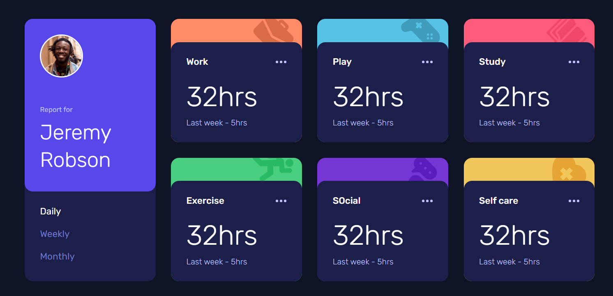

# Frontend Mentor - Time tracking dashboard solution

This is a solution to the [Time tracking dashboard challenge on Frontend Mentor](https://www.frontendmentor.io/challenges/time-tracking-dashboard-UIQ7167Jw). Frontend Mentor challenges help you improve your coding skills by building realistic projects.

## Table of contents

- [Overview](#overview)
  - [The challenge](#the-challenge)
  - [Screenshot](#screenshot)
  - [Links](#links)
- [My process](#my-process)
  - [Built with](#built-with)
  - [What I learned](#what-i-learned)
  - [Continued development](#continued-development)
  - [Useful resources](#useful-resources)
- [Author](#author)

## Overview

### The challenge

Users should be able to:

- View the optimal layout for the site depending on their device's screen size
- See hover states for all interactive elements on the page
- Switch between viewing Daily, Weekly, and Monthly stats

### Screenshot



### Links

- [Solution URL](https://github.com/crolette/time-tracking-dashboard)
- [Live Site URL](https://crolette.github.io/time-tracking-dashboard/)

## My process

### Built with

- Semantic HTML5 markup
- CSS custom properties
- Flexbox
- CSS Grid
- Media Queries to adjust to every screen sizes
- JSON manipulation
- Local storage

### What I learned

To see how you can add code snippets, see below:

```css
.dashboard {
  display: grid;
  grid-template-columns: repeat(4, 255px);
  gap: 30px;
}

#user {
  grid-column: 1;
  grid-row: span 2;
}
```

Retrieve JSON Datas

```js
async function retrieveJson() {
  const requestURL = "data.json";
  const request = new Request(requestURL);
  const response = await fetch(request);
  const datas = await response.json();
}
```

Local storage functions to store the selected timeline to display the datas

```js
function verifyLocalStorage() {
  if (localStorage.getItem("timeline") == null) {
    localStorage.setItem("timeline", "daily");
  } else {
    timelineChoice = localStorage.getItem("timeline");
  }
}
```

### Continued development

JSON manipulation / Grid

### Useful resources

- [CSS Tricks - Grid](https://css-tricks.com/snippets/css/complete-guide-grid/) - This helped me for using Grid.
- [MDN - LocalStorage](https://developer.mozilla.org/en-US/docs/Web/API/Window/localStorage) - Local Storage documentation
- [MDN - JSON](https://developer.mozilla.org/en-US/docs/Learn/JavaScript/Objects/JSON) - JSON documentation

## Author

- Website - [Crolweb](https://www.crolweb.be)
- Github - [Crolweb](https://github.com/crolette)
- Frontend Mentor - [@crolette](https://www.frontendmentor.io/profile/crolette)
